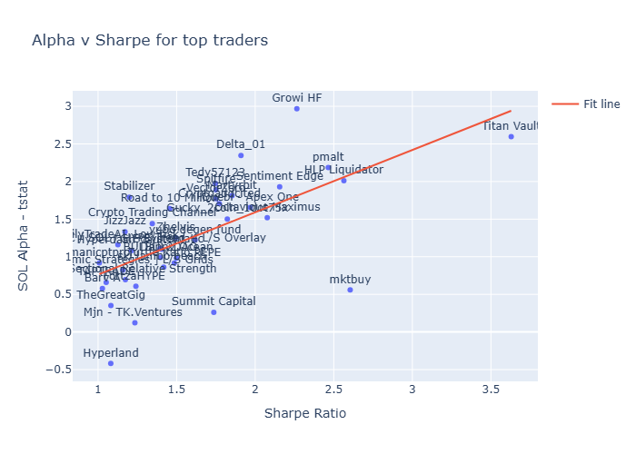
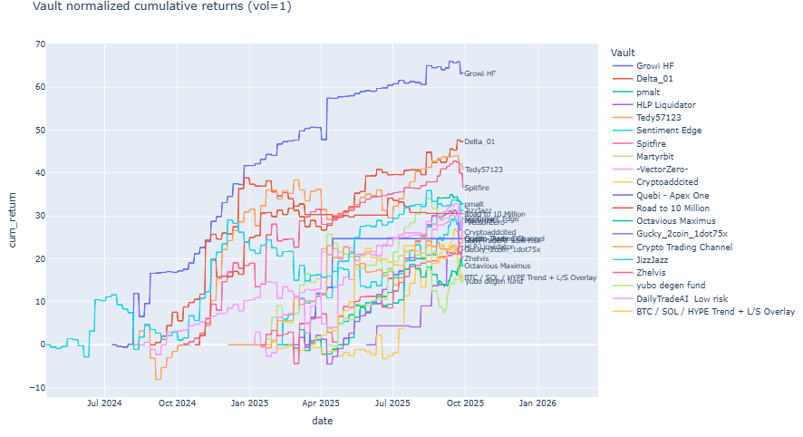
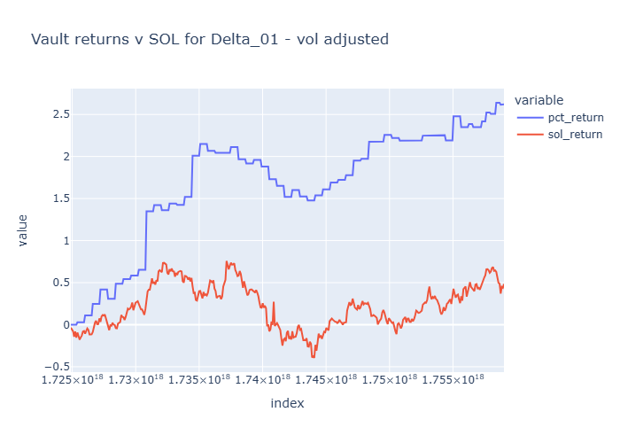
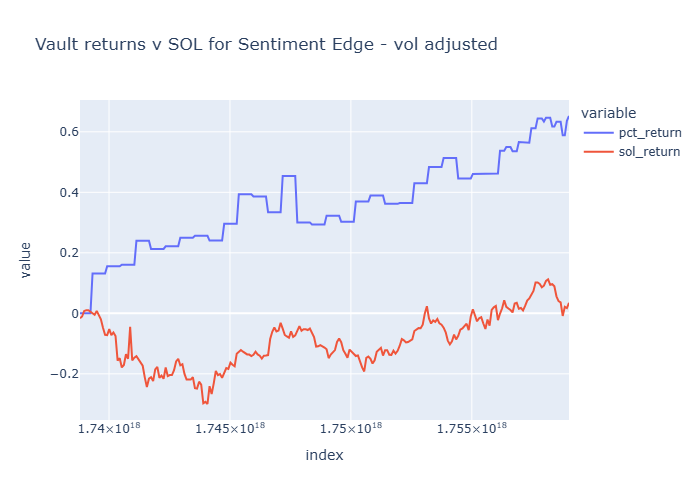
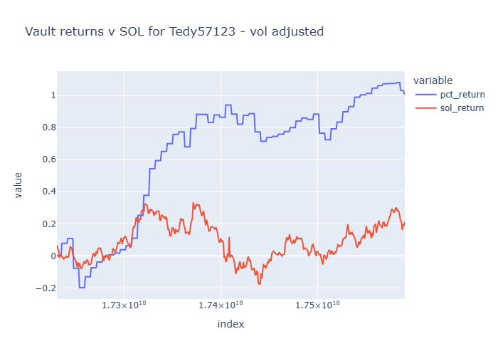

# Hyperliquid vaults - the search for alpha

Went through all vaults in Hyperlid, looking for alpha ... The average crypto participant couldn't care less about it but if all I want is beta I'd rather just buy BTC.
In traditional finance markets, it's very hard to do this kind of analysis but , in crypto, vaults provide a very interesting opportunity. Obviously alpha is scarce but the data is out there for us to look at in a way that doesn't exist in tradfi.
### Methodology 

- Retrieved data for all vaults and compute capital adjusted percentage returns. The goal was to adjust for capital changes which are frequent in vaults
- Compute alpha vs both SOL & Beta
- Compute sharpe
- Look for high sharpe traders that have ~ statistically significant across SOL & BTC
- Filter for traders with > 10k usd. Realistically I won't be comfortable to hand over my money to someone trading a very small amount of money
- Filter for >120 days of trading

Key stats for the top performers :

| Name                                 | TVL (kUSDT) | Sharpe Ratio | Gain % | SOL Alpha - tstat |
| :----------------------------------- | ----------: | -----------: | -----: | ----------------: |
| Growi HF                             |        3053 |          2.3 |     77 |                 3 |
| Delta_01                             |         812 |          1.9 |   1273 |               2.3 |
| pmalt                                |         119 |          2.5 |    484 |               2.2 |
| HLP Liquidator                       |         599 |          2.6 | 146493 |                 2 |
| Tedy57123                            |          22 |          1.7 |    173 |                 2 |
| Sentiment Edge                       |          60 |          2.2 |     91 |               1.9 |
| Spitfire                             |        1074 |          1.8 |    246 |               1.9 |
| Martyrbit                            |         972 |          1.9 |     27 |               1.8 |
| -VectorZero-                         |          17 |          1.8 |     79 |               1.8 |
| Cryptoaddcited                       |         140 |          1.8 |     48 |               1.7 |
| Quebi - Apex One                     |          12 |            2 |      8 |               1.7 |
| Road to 10 Million                   |         180 |          1.5 |    123 |               1.6 |
| Octavious Maximus                    |          12 |          2.1 |    345 |               1.5 |
| Gucky_2coin_1dot75x                  |          14 |          1.8 |     41 |               1.5 |
| Crypto Trading Channel               |          71 |          1.3 |     16 |               1.4 |
| JizzJazz                             |          54 |          1.2 |    177 |               1.3 |
| Zhelvis                              |          13 |          1.5 |    134 |               1.3 |
| yubo degen fund                      |         125 |          1.6 |     77 |               1.2 |
| DailyTradeAI  Low risk               |         428 |          1.1 |     87 |               1.2 |
| BTC / SOL / HYPE Trend + L/S Overlay |          50 |          1.4 |     29 |               1.1 |

Some vaults like **Growi 01, Delta_01, pmalt, Sentiment Edge & Spitfire** look very interesting - high sharpe with statically significant alpha.

