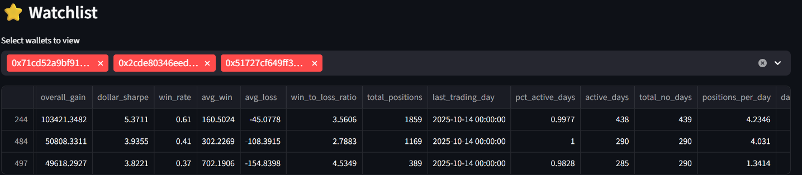
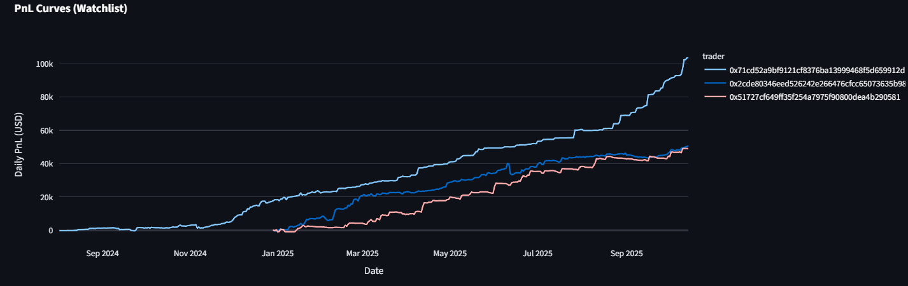

### Search for alpha
Inspired by the HPL vault exercise, where we queried on-chain data to find the vaults with the most alpha, I went down the Polymarket rabbit hole looking for profitable traders that I could replicate.
Unlike HPL, there is no such things as vaults, that allow you to easily invest into a trader, so besides profitability I needed to find traders that I could reasonably replicate after transaction costs. This likely rules out anyone that scalps for small percentage gains or does market making.

### Data scraping
I was struggling a bit to get the data as getting individual trades for each wallet on poly + prices for each market and building pnl out of that was a hard ask for a weekend project. However, polymarketanalytics already does the work of building out the pnl curve and gives you the latest 1000 trades. They don't have an official api but you can reverse engineer it through "inspect".

Polymarketanalytics also gives you leaderboards based on different criteria, which I used to get as many wallets as possible. I then looped through all of them and got their pnl curves, summary metrics and list of latest trades. For each of them I computed the following metrics :
 - Sharpe from daily $ pnl
 - Avg win / avg loss - trying to weed out scalpers, so want a big ratio here
 - Trades per day - again remove higher frequency traders
 - Trades per event - an event represents the things they bet on, trying to weed out people that do too much trading around a position as it may be harder to replicate
 - Last active - want people that were active 
 - Number of trades : Again, want a high enough number that it is statistically significant but not high enough that implies they are a market maker/scalper

### Dashboard + choosing traders
Armed with this data, asked Cursor (Claude 4.5) to build me a streamlist dash in python to go through this data. It allows for sorting wallets by a given metric, filter by all the metrics computed, save those filters for future use and also add traders to a watchlist.

The pnl curves for my current watchlist follow below. These wallets are active every day, have traded >=280 days, take around 1-4 positions per day and trade ~2-6 times per event which I think is reasonable. Sharpes are between 3-5.
The next step is then to figure out how to copy trade them - for now I am using polycule and if you choose to do the same please use my code : polycule.trade/join/303m9f .

Will keep you updated on my performance!

