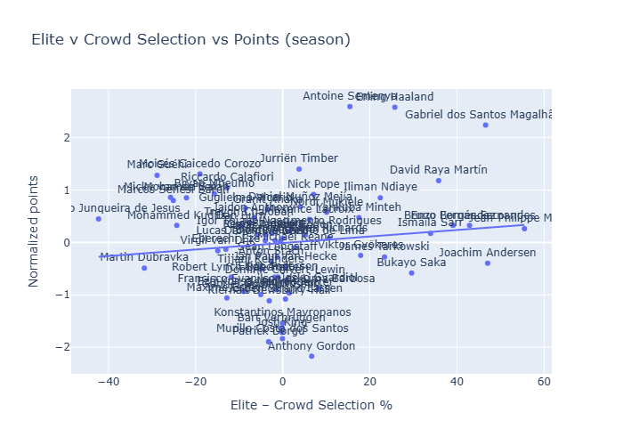
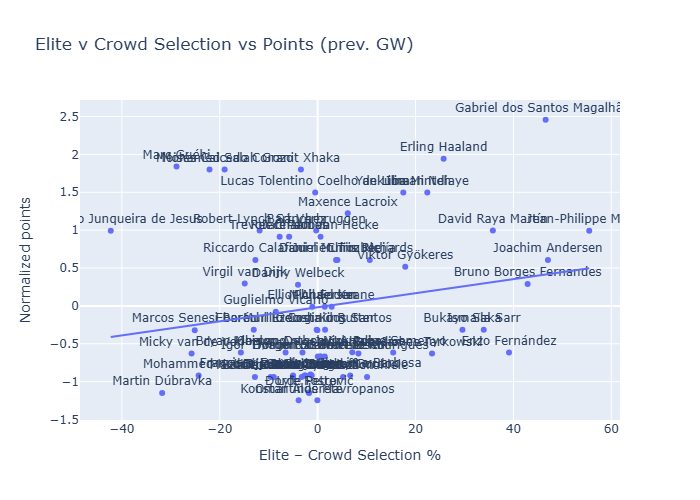
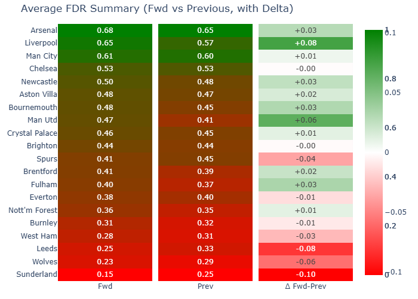
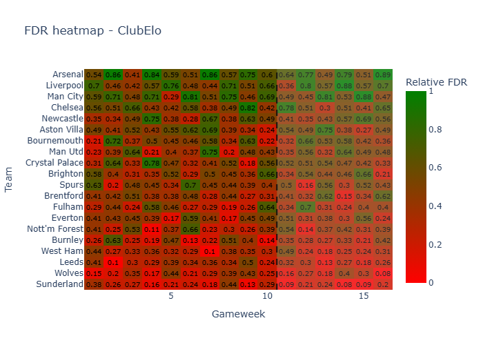

### TLDR
- Haaland continues to perform at a high level and justify the overweight from HoF managers. Arsenal's defense with Gabriel & Raya is close behind, followed by Semenyo
- Liverpool has a tough match against City but fixtures get much easier after that
- On the flip side, Leeds and Sunderland are about to go on extremely difficult runs
- Mitoma expected points drifting higher as a return to the pitch is expected soon (if you trust Hurzeler)
- Looking at the list of players that are under pressure to be transferred out, you have players like Mbeumo that are going to AFCON but also Haaland or Gabriel on "reversion to the mean" reasons
### Elite players and performance

### FDR

### Measuring transfer pressure

##### Pressure to transfer in

| name                               |   crowd_own |   elite_owner_rate |   Xpts delta vs past - zscore |   Delta in FDR vs past - zscore |   Weighted zscore |   Probability of buying |
|:-----------------------------------|------------:|-------------------:|------------------------------:|--------------------------------:|------------------:|------------------------:|
| Mitoma Kaoru                       |        0.02 |               0    |                          2.88 |                            0.83 |              2.27 |                    0.94 |
| Alisson Becker                     |        0.06 |               0    |                          2.9  |                           -0.11 |              1.99 |                    0.92 |
| Rodrigo 'Rodri' Hernandez Cascante |        0    |               0    |                          2.57 |                            0.49 |              1.95 |                    0.92 |
| Lucas Estella Perri                |        0    |               0    |                          2.51 |                            0.04 |              1.77 |                    0.9  |
| Cole Palmer                        |        0.1  |               0    |                          2.15 |                            0.82 |              1.75 |                    0.9  |
| Tino Livramento                    |        0.03 |               0    |                          2.23 |                            0.04 |              1.57 |                    0.88 |
| Enzo Fernández                     |        0.15 |               0.54 |                          1.86 |                            0.82 |              1.55 |                    0.87 |
| Cristian Romero                    |        0.04 |               0    |                          2.02 |                            0.03 |              1.42 |                    0.86 |
| Reinildo Mandava                   |        0.05 |               0    |                          1.18 |                            1.87 |              1.39 |                    0.85 |
| Rayan Aït-Nouri                    |        0.05 |               0    |                          1.8  |                            0.42 |              1.38 |                    0.85 |
| Jaidon Anthony                     |        0.07 |               0    |                          1.63 |                            0.66 |              1.34 |                    0.84 |
| Crysencio Summerville              |        0    |               0    |                          1.51 |                            0.93 |              1.34 |                    0.84 |
| Martin Ødegaard                    |        0.01 |               0    |                          2.07 |                           -0.47 |              1.31 |                    0.84 |
| Hwang Hee-chan                     |        0    |               0    |                          1.04 |                            1.89 |              1.29 |                    0.83 |
| Rodrigo Muniz Carvalho             |        0.01 |               0    |                          2.04 |                           -0.59 |              1.25 |                    0.83 |
##### Pressure to transfer out

| name                            |   crowd_own |   elite_owner_rate |   Xpts delta vs past - zscore |   Delta in FDR vs past - zscore |   Weighted zscore |   Probability of selling |
|:--------------------------------|------------:|-------------------:|------------------------------:|--------------------------------:|------------------:|-------------------------:|
| Gabriel dos Santos Magalhães    |        0.41 |               0.88 |                         -4.47 |                           -0.5  |             -3.28 |                     0.98 |
| Eli Junior Kroupi               |        0    |               0    |                         -3.38 |                           -1.3  |             -2.76 |                     0.97 |
| Declan Rice                     |        0.15 |               0    |                         -3.54 |                           -0.47 |             -2.62 |                     0.96 |
| Nico O'Reilly                   |        0.01 |               0    |                         -3.91 |                            0.42 |             -2.61 |                     0.96 |
| Reece James                     |        0.08 |               0.02 |                         -4.02 |                            0.74 |             -2.59 |                     0.96 |
| Rodrigo Bentancur               |        0    |               0    |                         -3.42 |                            0.09 |             -2.37 |                     0.95 |
| Bryan Mbeumo                    |        0.3  |               0.14 |                         -2.58 |                           -1.32 |             -2.2  |                     0.94 |
| Leandro Trossard                |        0.01 |               0    |                         -2.86 |                           -0.47 |             -2.14 |                     0.94 |
| Jurriën Timber                  |        0.26 |               0.3  |                         -2.51 |                           -0.5  |             -1.91 |                     0.92 |
| Bruno Guimarães Rodriguez Moura |        0.04 |               0    |                         -2.7  |                            0.09 |             -1.86 |                     0.91 |
| David Raya Martín               |        0.32 |               0.68 |                         -2.45 |                           -0.45 |             -1.85 |                     0.91 |
| Josh Acheampong                 |        0.02 |               0    |                         -2.92 |                            0.74 |             -1.83 |                     0.91 |
| Erling Haaland                  |        0.72 |               0.98 |                         -2.7  |                            0.34 |             -1.79 |                     0.9  |
| Giorgi Mamardashvili            |        0.01 |               0    |                         -2.48 |                           -0.11 |             -1.77 |                     0.9  |
| Carlos Henrique Casimiro        |        0    |               0    |                         -1.96 |                           -1.32 |             -1.77 |                     0.9  |