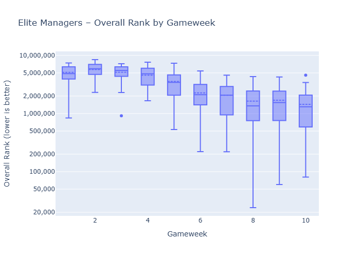
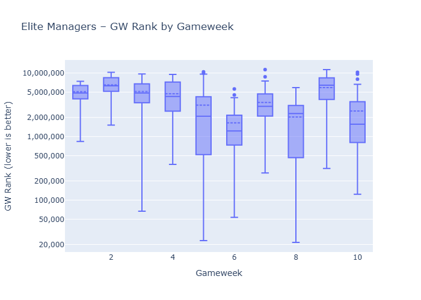

Anoop remains the top ranked HoF manager. The goat, Ben Crellin, also did ok on the gameweek but still ranked ~2m - the bet on Gyokeres vs the weak Burnley paid off.

Looking at HoF top picks, Gabriel, Haaland and Semenyo were solid picks this week. Players like Saka and Joachim Andresen performed poorly.

# Top 3 Starters by Gameweek
|  gw | Top1                        | Top2                                     | Top3                                     |
| --: | :-------------------------- | :--------------------------------------- | :--------------------------------------- |
|   1 | Cole Palmer (50, 100.0%)    | Mohamed Salah (49, 98.0%)                | Pedro Porro Sauceda (45, 90.0%)          |
|   2 | Mohamed Salah (49, 98.0%)   | Maxime Estève (41, 82.0%)                | Florian Wirtz (34, 68.0%)                |
|   3 | Mohamed Salah (48, 96.0%)   | Pedro Porro Sauceda (44, 88.0%)          | Bruno Borges Fernandes (34, 68.0%)       |
|   4 | Mohamed Salah (49, 98.0%)   | Pedro Porro Sauceda (37, 74.0%)          | Bruno Borges Fernandes (33, 66.0%)       |
|   5 | Mohamed Salah (48, 96.0%)   | Bruno Borges Fernandes (33, 66.0%)       | Joachim Andersen (33, 66.0%)             |
|   6 | Erling Haaland (50, 100.0%) | Tijjani Reijnders (43, 86.0%)            | Antoine Semenyo (42, 84.0%)              |
|   7 | Erling Haaland (48, 96.0%)  | Marcos Senesi Barón (43, 86.0%)          | Antoine Semenyo (42, 84.0%)              |
|   8 | Erling Haaland (49, 98.0%)  | Antoine Semenyo (44, 88.0%)              | Gabriel dos Santos Magalhães (42, 84.0%) |
|   9 | Erling Haaland (49, 98.0%)  | Antoine Semenyo (45, 90.0%)              | Marcos Senesi Barón (45, 90.0%)          |
|  10 | Erling Haaland (49, 98.0%)  | Gabriel dos Santos Magalhães (44, 88.0%) | Antoine Semenyo (41, 82.0%)              |
# Top 3 Captains by Gameweek
|  gw | Top1                               | Top2                             | Top3                             |
| --: | :--------------------------------- | :------------------------------- | :------------------------------- |
|   1 | Mohamed Salah (49, 98.0%)          | Erling Haaland (1, 2.0%)         | None                             |
|   2 | Mohamed Salah (46, 92.0%)          | Bukayo Saka (3, 6.0%)            | Erling Haaland (1, 2.0%)         |
|   3 | Bruno Borges Fernandes (27, 54.0%) | Mohamed Salah (11, 22.0%)        | Chris Wood (5, 10.0%)            |
|   4 | Mohamed Salah (49, 98.0%)          | Erling Haaland (1, 2.0%)         | None                             |
|   5 | Mohamed Salah (47, 94.0%)          | Antoine Semenyo (1, 2.0%)        | Bruno Borges Fernandes (1, 2.0%) |
|   6 | Erling Haaland (50, 100.0%)        | None                             | None                             |
|   7 | Erling Haaland (47, 94.0%)         | Bukayo Saka (2, 4.0%)            | Viktor Gyökeres (1, 2.0%)        |
|   8 | Erling Haaland (49, 98.0%)         | Mohamed Salah (1, 2.0%)          | None                             |
|   9 | Erling Haaland (48, 96.0%)         | Bruno Borges Fernandes (1, 2.0%) | Mohamed Salah (1, 2.0%)          |
|  10 | Erling Haaland (48, 96.0%)         | Bukayo Saka (2, 4.0%)            | None                             |
### Subbed IN (biggest increases)
| player                           | latest | prev | delta |
| :------------------------------- | -----: | ---: | ----: |
| Jean-Philippe Mateta             |     39 |    8 |    31 |
| Joachim Andersen                 |     25 |    0 |    25 |
| Ismaïla Sarr                     |     23 |    3 |    20 |
| Nordi Mukiele                    |      8 |    0 |     8 |
| Daniel Muñoz Mejía               |     10 |    3 |     7 |
| Yankuba Minteh                   |     11 |    4 |     7 |
| Chris Richards                   |      7 |    0 |     7 |
| Bryan Mbeumo                     |      7 |    3 |     4 |
| Igor Thiago Nascimento Rodrigues |      5 |    1 |     4 |
| Jurriën Timber                   |     15 |   11 |     4 |
### Subbed OUT (biggest decreases)
| player                        | latest | prev | delta |
| :---------------------------- | -----: | ---: | ----: |
| Marcos Senesi Barón           |      1 |   45 |   -44 |
| João Pedro Junqueira de Jesus |      2 |   35 |   -33 |
| Joe Rodon                     |      6 |   20 |   -14 |
| Gabriel Gudmundsson           |      0 |    5 |    -5 |
| Viktor Gyökeres               |     20 |   25 |    -5 |
| Antoine Semenyo               |     41 |   45 |    -4 |
| Eli Junior Kroupi             |      0 |    3 |    -3 |
| Maxime Estève                 |      0 |    3 |    -3 |
| Dominic Calvert-Lewin         |      1 |    4 |    -3 |
| Tijjani Reijnders             |     10 |   13 |    -3 |

