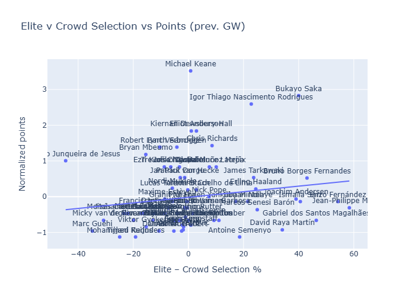
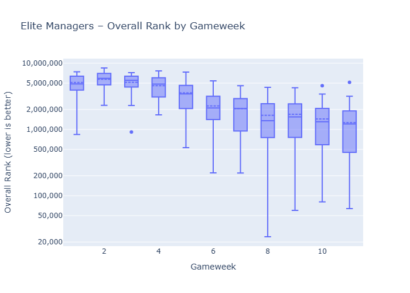
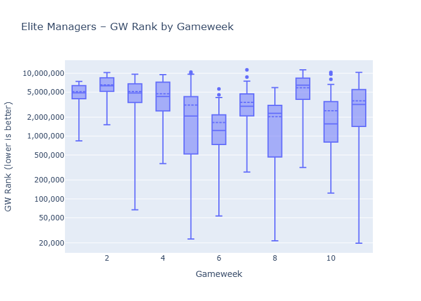
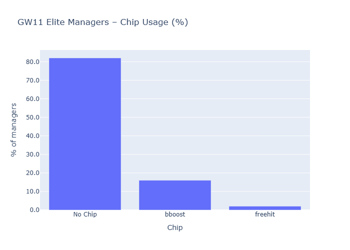

Not a particularly easy week for elite managers - the median placement improved slightly WoW but still struggling quite a bit this season.
Major trends were :
- [ ] Almost every single manager dropped Gyokeres - which makes sense given injure. Reijnders, Mukiele & Gvardiol also got dropped but they were less favoured by elite managers, compared to Gyokeres
- [ ] Haaland remained the top pick, with some outliers trying out Saka - which turned out to be the best choice
- [ ] Igor Thiago got some love after a strong run and answered with 2 goals vs Newcastle. 8 goals in 11 games this season. Senesi was also a top pick but poor performance vs Villa

# Top 3 Starters by Gameweek
|  gw | Top1                        | Top2                                     | Top3                                     |
| --: | :-------------------------- | :--------------------------------------- | :--------------------------------------- |
|   1 | Cole Palmer (50, 100.0%)    | Mohamed Salah (49, 98.0%)                | Pedro Porro Sauceda (45, 90.0%)          |
|   2 | Mohamed Salah (49, 98.0%)   | Maxime Estève (41, 82.0%)                | Florian Wirtz (34, 68.0%)                |
|   3 | Mohamed Salah (48, 96.0%)   | Pedro Porro Sauceda (44, 88.0%)          | Bruno Borges Fernandes (34, 68.0%)       |
|   4 | Mohamed Salah (49, 98.0%)   | Pedro Porro Sauceda (37, 74.0%)          | Bruno Borges Fernandes (33, 66.0%)       |
|   5 | Mohamed Salah (48, 96.0%)   | Bruno Borges Fernandes (33, 66.0%)       | Joachim Andersen (33, 66.0%)             |
|   6 | Erling Haaland (50, 100.0%) | Tijjani Reijnders (43, 86.0%)            | Antoine Semenyo (42, 84.0%)              |
|   7 | Erling Haaland (48, 96.0%)  | Marcos Senesi Barón (43, 86.0%)          | Antoine Semenyo (42, 84.0%)              |
|   8 | Erling Haaland (49, 98.0%)  | Antoine Semenyo (44, 88.0%)              | Gabriel dos Santos Magalhães (42, 84.0%) |
|   9 | Erling Haaland (49, 98.0%)  | Antoine Semenyo (45, 90.0%)              | Marcos Senesi Barón (45, 90.0%)          |
|  10 | Erling Haaland (49, 98.0%)  | Gabriel dos Santos Magalhães (44, 88.0%) | Antoine Semenyo (41, 82.0%)              |
|  11 | Erling Haaland (49, 98.0%)  | Gabriel dos Santos Magalhães (46, 92.0%) | Jean-Philippe Mateta (44, 88.0%)         |
# Top 3 Captains by Gameweek
|  gw | Top1                               | Top2                             | Top3                             |
| --: | :--------------------------------- | :------------------------------- | :------------------------------- |
|   1 | Mohamed Salah (49, 98.0%)          | Erling Haaland (1, 2.0%)         | None                             |
|   2 | Mohamed Salah (46, 92.0%)          | Bukayo Saka (3, 6.0%)            | Erling Haaland (1, 2.0%)         |
|   3 | Bruno Borges Fernandes (27, 54.0%) | Mohamed Salah (11, 22.0%)        | Chris Wood (5, 10.0%)            |
|   4 | Mohamed Salah (49, 98.0%)          | Erling Haaland (1, 2.0%)         | None                             |
|   5 | Mohamed Salah (47, 94.0%)          | Antoine Semenyo (1, 2.0%)        | Bruno Borges Fernandes (1, 2.0%) |
|   6 | Erling Haaland (50, 100.0%)        | None                             | None                             |
|   7 | Erling Haaland (47, 94.0%)         | Bukayo Saka (2, 4.0%)            | Viktor Gyökeres (1, 2.0%)        |
|   8 | Erling Haaland (49, 98.0%)         | Mohamed Salah (1, 2.0%)          | None                             |
|   9 | Erling Haaland (48, 96.0%)         | Bruno Borges Fernandes (1, 2.0%) | Mohamed Salah (1, 2.0%)          |
|  10 | Erling Haaland (48, 96.0%)         | Bukayo Saka (2, 4.0%)            | None                             |
|  11 | Erling Haaland (44, 88.0%)         | Bukayo Saka (4, 8.0%)            | Jean-Philippe Mateta (2, 4.0%)   |
### Subbed IN (biggest increases)
| player                           | latest | prev | delta |
| :------------------------------- | -----: | ---: | ----: |
| Marcos Senesi Barón              |     26 |    1 |    25 |
| Igor Thiago Nascimento Rodrigues |     16 |    5 |    11 |
| Enzo Fernández                   |     35 |   27 |     8 |
| Martin Dúbravka                  |     10 |    2 |     8 |
| Jean-Philippe Mateta             |     44 |   39 |     5 |
| Bukayo Saka                      |     29 |   24 |     5 |
| Ismaïla Sarr                     |     27 |   23 |     4 |
| Jurriën Timber                   |     19 |   15 |     4 |
| Maxime Estève                    |      2 |    0 |     2 |
| Joe Rodon                        |      8 |    6 |     2 |
### Subbed OUT (biggest decreases)
| player            | latest | prev | delta |
| :---------------- | -----: | ---: | ----: |
| Viktor Gyökeres   |      0 |   20 |   -20 |
| Tijjani Reijnders |      1 |   10 |    -9 |
| Nordi Mukiele     |      0 |    8 |    -8 |
| Joško Gvardiol    |      1 |    7 |    -6 |
| Anthony Gordon    |      0 |    5 |    -5 |
| Joachim Andersen  |     21 |   25 |    -4 |
| Mohammed Kudus    |      0 |    4 |    -4 |
| Virgil van Dijk   |      2 |    5 |    -3 |
| Bart Verbruggen   |      0 |    2 |    -2 |
| Micky van de Ven  |      2 |    4 |    -2 |

