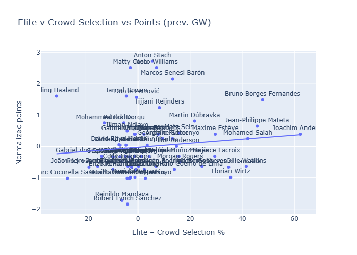
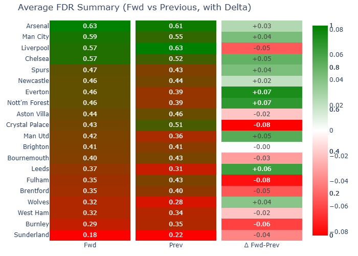
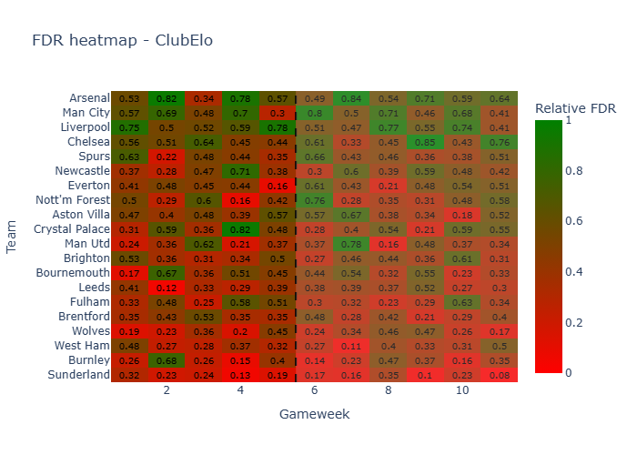

### TLDR

- Stach, Andersen and Senesi are silent overperformers that HoF managers are not ignoring
- Elite favorites Bruno Fernandes and Salah holding toe to toe with Haaland. Defcons, clean sheet and strong goal potential likely make them preferred vs Haaland 
- Burnley and Sunderland about to go on a very tough streak
- HoF managers are likely to dump Joao Pedro & Semenyo over next few weeks
- Pinnock & Robinson (already played on EFL cup) could be interesting differentials as their fixtures get easier next few GWs and barely anyone has them on their team
- Elite managers have suffered with Watkins and Wirtz
### Elite favourites and performance

The chart below shows Elite v Crowd selection vs position-normalized points for each player.
You can see Elite favourites like Wirtz and Watkins below the line, while others like Bruno Fernandes have deserved their favouritism. You can also see Senesi and Stach popping up as over-performers with a small bias from Elite managers. Haaland strong performance season-to-date has been the other major hurdle to Elite success so far.

### FDR view

Going forward, I try to understand what transfers/actions Elite managers are likely to take in the next few gameweeks. One way is to compare season to date FDR vs forward (net 6 GWs) -- in theory teams with higher FDR (easier games) would get more attention from managers.

- Everton and Nottingham have the biggest change
- Arsenal and City have the easiest next 6 GWs but only slightly easier than so far
- Teams like Burnley and Sunderland have had a terrible time so far and should only get worse
- Crystal Palace should drop from one with the easiest fixtures to one with hard matchups ahead
- Most imbalanced fixture is this weekend Burnley v City. Nottingham Forest v Sunderland is a close second

### Measuring transfer pressure

Using expected points from SolioAnalytics I compare season to date expected points vs expected points for next 6 gameweeks. Players with strong HoF selection rate & an expected big drop in points (or increase in fixture difficulty) are under more pressure to be subbed out while players with a projected increase in points could be subbed in.

The table below change in expected points and FDR to measure those with biggest positive improvement in expectations. I combine the two zscores and using tanh map it to a probability of buying (and selling).

Amongst those with high pressure to transfer in, there is a lot of injury plays such as Matheus Cunha & Palmer. Isak is interesting. Robinson and Pinnock, booster by easier fixtures, are also interesting picks.

Looking at those most likely to be transferred out, Joao Pedro and Semenyo look good candidates as they combined an expected worsening of performance with very high Elite selection rate.

##### Pressure to transfer in

| name                             | crowd_own | elite_owner_rate | Xpts delta vs past - zscore | Delta in FDR vs past - zscore | Weighted zscore | Probability of buying |
| :------------------------------- | --------: | ---------------: | --------------------------: | ----------------------------: | --------------: | --------------------: |
| Bukayo Saka                      |      0.04 |                0 |                        3.41 |                         -0.17 |            2.34 |                  0.95 |
| Anthony Gordon                   |      0.01 |                0 |                        2.79 |                          -0.1 |            1.92 |                  0.92 |
| Matheus Santos Carneiro da Cunha |      0.04 |                0 |                        2.92 |                         -0.45 |            1.91 |                  0.92 |
| Alexander Isak                   |       0.1 |                0 |                         2.4 |                          0.28 |            1.77 |                   0.9 |
| Cole Palmer                      |      0.22 |                0 |                        2.92 |                            -1 |            1.74 |                   0.9 |
| Justin Kluivert                  |      0.01 |                0 |                        1.64 |                          1.41 |            1.57 |                  0.88 |
| Martin Ødegaard                  |      0.02 |                0 |                        2.25 |                         -0.17 |            1.52 |                  0.87 |
| Noah Okafor                      |         0 |                0 |                        2.08 |                         -0.02 |            1.45 |                  0.86 |
| Jarrad Branthwaite               |         0 |                0 |                        2.62 |                         -1.32 |            1.44 |                  0.86 |
| Antonee Robinson                 |      0.01 |                0 |                        1.31 |                          1.58 |            1.39 |                  0.85 |
| Ethan Ampadu                     |         0 |                0 |                        1.94 |                         -0.02 |            1.35 |                  0.84 |
| Ethan Pinnock                    |         0 |                0 |                        1.49 |                          1.01 |            1.35 |                  0.84 |
| Tanaka Ao                        |         0 |                0 |                        1.91 |                         -0.02 |            1.33 |                  0.84 |
| Vitalii Mykolenko                |         0 |                0 |                        2.41 |                         -1.32 |            1.29 |                  0.83 |
| Jørgen Strand Larsen             |      0.02 |             0.04 |                        1.84 |                         -0.29 |             1.2 |                  0.82 |

##### Pressure to transfer out

| name                          |   crowd_own |   elite_owner_rate |   Xpts delta vs past - zscore |   Delta in FDR vs past - zscore |   Weighted zscore |   Probability of selling |
|:------------------------------|------------:|-------------------:|------------------------------:|--------------------------------:|------------------:|-------------------------:|
| Jurriën Timber                |        0.13 |               0    |                         -5.14 |                           -0.15 |             -3.64 |                     0.99 |
| Enzo Fernández                |        0.14 |               0.04 |                         -3.8  |                           -1    |             -2.96 |                     0.98 |
| Trevoh Chalobah               |        0.09 |               0    |                         -3.74 |                           -1    |             -2.92 |                     0.97 |
| Moisés Caicedo Corozo         |        0.1  |               0    |                         -3.67 |                           -1    |             -2.87 |                     0.97 |
| João Pedro Junqueira de Jesus |        0.67 |               0.52 |                         -3.6  |                           -1    |             -2.82 |                     0.97 |
| Riccardo Calafiori            |        0.14 |               0    |                         -3.68 |                           -0.15 |             -2.62 |                     0.96 |
| Guglielmo Vicario             |        0.12 |               0.02 |                         -2.93 |                           -1.55 |             -2.52 |                     0.96 |
| Jack Grealish                 |        0.22 |               0    |                         -3    |                           -1.31 |             -2.49 |                     0.96 |
| Hugo Ekitiké                  |        0.28 |               0    |                         -3.66 |                            0.28 |             -2.48 |                     0.96 |
| Brennan Johnson               |        0.08 |               0    |                         -2.7  |                           -1.53 |             -2.35 |                     0.95 |
| Nick Pope                     |        0.06 |               0    |                         -3.11 |                           -0.05 |             -2.19 |                     0.94 |
| Jordan Pickford               |        0.11 |               0    |                         -2.49 |                           -1.32 |             -2.14 |                     0.94 |
| James Trafford                |        0.02 |               0    |                         -2.68 |                           -0.8  |             -2.12 |                     0.93 |
| Michael Keane                 |        0.01 |               0    |                         -2.42 |                           -1.32 |             -2.09 |                     0.93 |
| Antoine Semenyo               |        0.45 |               0.58 |                         -3.52 |                            1.41 |             -2.04 |                     0.93 |
