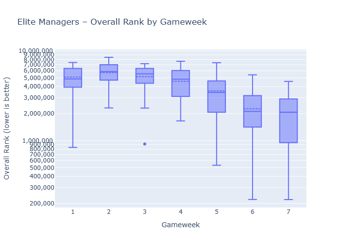
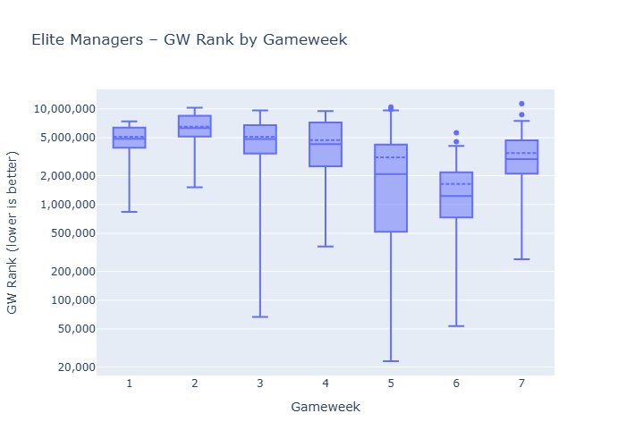
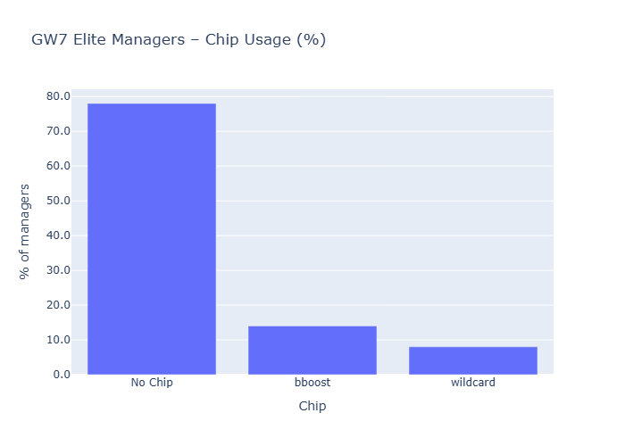

Not a great week for HoF managers overall but most improved WoW.
Haaland remained the most selected player, followed by Senesi and Semenyo. Haaland was the dominant captain, with only 2 managers trying Saka and 1 Gyokeres.
Gabriel was the most subbed in player, which turned out ok with the Arsenal clean sheet. Saka also had 6 new managers selecting him. On the other hand, Pedro Porro, Selz & N. Williams were subbed out by 5 people.

#### Latest GW7 vs GW6 – Starters deltas (by unique teams)

##### Subbed IN (biggest increases)

| player                       |   latest |   prev |   delta |
|:-----------------------------|---------:|-------:|--------:|
| Gabriel dos Santos Magalhães |       36 |     21 |      15 |
| Martin Dúbravka              |        9 |      1 |       8 |
| Marcos Senesi Barón          |       43 |     36 |       7 |
| Viktor Gyökeres              |       37 |     30 |       7 |
| Anthony Gordon               |        6 |      0 |       6 |
| Bukayo Saka                  |       10 |      4 |       6 |
| Anton Stach                  |       10 |      4 |       6 |
| Maxence Lacroix              |        9 |      3 |       6 |
| Chris Richards               |        4 |      0 |       4 |
| Joe Rodon                    |        4 |      0 |       4 | 

##### Subbed OUT (biggest decreases)

| player                        |   latest |   prev |   delta |
|:------------------------------|---------:|-------:|--------:|
| Matz Sels                     |        2 |      7 |      -5 |
| Neco Williams                 |        0 |      5 |      -5 |
| Pedro Porro Sauceda           |        7 |     12 |      -5 |
| Micky van de Ven              |        5 |      9 |      -4 |
| James Tarkowski               |       19 |     23 |      -4 |
| Florian Wirtz                 |        0 |      4 |      -4 |
| Kiernan Dewsbury-Hall         |        0 |      4 |      -4 |
| Richarlison de Andrade        |        5 |      9 |      -4 |
| Cody Gakpo                    |        0 |      3 |      -3 |
| João Pedro Junqueira de Jesus |       31 |     34 |      -3 |

#### Top 3 Starters by Gameweek

|   gw | Top1                        | Top2                               | Top3                               |
|-----:|:----------------------------|:-----------------------------------|:-----------------------------------|
|    1 | Cole Palmer (50, 100.0%)    | Mohamed Salah (49, 98.0%)          | Pedro Porro Sauceda (45, 90.0%)    |
|    2 | Mohamed Salah (49, 98.0%)   | Maxime Estève (41, 82.0%)          | Florian Wirtz (34, 68.0%)          |
|    3 | Mohamed Salah (48, 96.0%)   | Pedro Porro Sauceda (44, 88.0%)    | Bruno Borges Fernandes (34, 68.0%) |
|    4 | Mohamed Salah (49, 98.0%)   | Pedro Porro Sauceda (37, 74.0%)    | Bruno Borges Fernandes (33, 66.0%) |
|    5 | Mohamed Salah (48, 96.0%)   | Bruno Borges Fernandes (33, 66.0%) | Joachim Andersen (33, 66.0%)       |
|    6 | Erling Haaland (50, 100.0%) | Tijjani Reijnders (43, 86.0%)      | Antoine Semenyo (42, 84.0%)        |
|    7 | Erling Haaland (48, 96.0%)  | Marcos Senesi Barón (43, 86.0%)    | Antoine Semenyo (42, 84.0%)        | 

#### Top 3 Captains by Gameweek

|   gw | Top1                               | Top2                      | Top3                             |
|-----:|:-----------------------------------|:--------------------------|:---------------------------------|
|    1 | Mohamed Salah (49, 98.0%)          | Erling Haaland (1, 2.0%)  | None                             |
|    2 | Mohamed Salah (46, 92.0%)          | Bukayo Saka (3, 6.0%)     | Erling Haaland (1, 2.0%)         |
|    3 | Bruno Borges Fernandes (27, 54.0%) | Mohamed Salah (11, 22.0%) | Chris Wood (5, 10.0%)            |
|    4 | Mohamed Salah (49, 98.0%)          | Erling Haaland (1, 2.0%)  | None                             |
|    5 | Mohamed Salah (47, 94.0%)          | Antoine Semenyo (1, 2.0%) | Bruno Borges Fernandes (1, 2.0%) |
|    6 | Erling Haaland (50, 100.0%)        | None                      | None                             |
|    7 | Erling Haaland (47, 94.0%)         | Bukayo Saka (2, 4.0%)     | Viktor Gyökeres (1, 2.0%)        |

