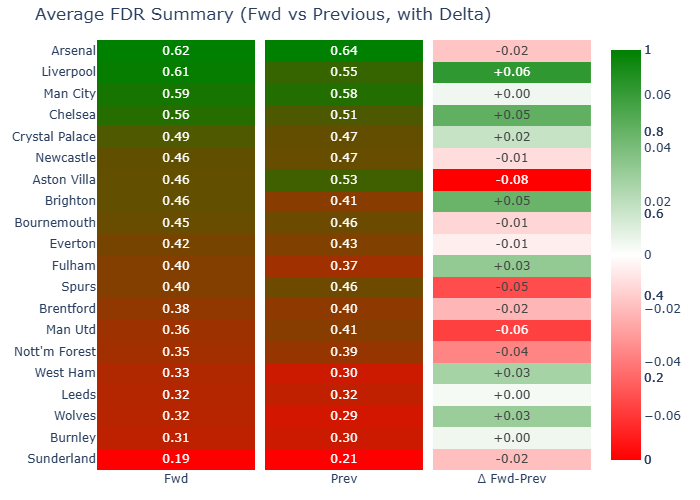

### TLDR
* Semenyo and Haaland are the HoF best picks so far
* Liverpool to go on a series of easier games
* Semenyo has been performing very well but tough games ahead in GW8,10 & 11

### Elite players and performance

Chasing Arsenal defensive strength with easy fixtures was also a common play that played out well. On the underperforming side, Gyokeres, Senesi, Reijnders & B. Fernandes have disappointed

### FDR

Arsenal, Liverpool and City have the easiest calendar for the next 6GWs. Followed by Chelsea, that has an easy GW8 + 11. 
Watkins, Konsa, Rogers & co. had their shot at something good but time quickly ran out with their next fixtures materially harder than the previous. On the flip side, Liverpool to go on a easier run for next 6 games after a tough run.

### Measuring transfer pressure

Using expected points from SolioAnalytics I compare season to date expected points vs expected points for next 6 gameweeks. Players with strong HoF selection rate & an expected big drop in points (or increase in fixture difficulty) are under more pressure to be subbed out while players with a projected increase in points could be subbed in.

Semenyo has been performing very well but tough games ahead in GW8,10 & 11. Saka looks good for next few GWs, with few managers picking him still and favourable fixture run.

##### Pressure to transfer in

| name                             |   crowd_own |   elite_owner_rate |   Xpts delta vs past - zscore |   Delta in FDR vs past - zscore |   Weighted zscore |   Probability of buying |
|:---------------------------------|------------:|-------------------:|------------------------------:|--------------------------------:|------------------:|------------------------:|
| Bukayo Saka                      |        0.09 |               0.2  |                          3.38 |                            0.99 |              2.66 |                    0.97 |
| Lucas Pires Silva                |        0    |               0    |                          3.47 |                            0    |              2.43 |                    0.95 |
| Hannes Delcroix                  |        0    |               0    |                          3.47 |                            0    |              2.43 |                    0.95 |
| Youri Tielemans                  |        0.01 |               0    |                          2.44 |                            2.17 |              2.36 |                    0.95 |
| Matheus Santos Carneiro da Cunha |        0.04 |               0.02 |                          2.86 |                            1.08 |              2.33 |                    0.95 |
| Axel Tuanzebe                    |        0.02 |               0    |                          3.28 |                            0    |              2.29 |                    0.95 |
| Anthony Gordon                   |        0.02 |               0.12 |                          2.14 |                            1.1  |              1.83 |                    0.91 |
| Lucas Estella Perri              |        0    |               0    |                          2.58 |                            0    |              1.81 |                    0.91 |
| Martin Ødegaard                  |        0.02 |               0    |                          2.12 |                            0.99 |              1.78 |                    0.9  |
| Rayan Aït-Nouri                  |        0.06 |               0    |                          2.56 |                           -0.14 |              1.75 |                    0.9  |
| Jarrad Branthwaite               |        0    |               0    |                          2.35 |                           -0.25 |              1.57 |                    0.88 |
| William Saliba                   |        0.13 |               0    |                          1.76 |                            0.99 |              1.53 |                    0.87 |
| Jørgen Strand Larsen             |        0.01 |               0.04 |                          2.21 |                           -0.13 |              1.51 |                    0.87 |
| Murillo Costa dos Santos         |        0.03 |               0    |                          2    |                            0.24 |              1.47 |                    0.86 |
| Omar Marmoush                    |        0.03 |               0    |                          2.09 |                           -0.13 |              1.42 |                    0.86 |
##### Pressure to transfer out

| name                  |   crowd_own |   elite_owner_rate |   Xpts delta vs past - zscore |   Delta in FDR vs past - zscore |   Weighted zscore |   Probability of selling |
|:----------------------|------------:|-------------------:|------------------------------:|--------------------------------:|------------------:|-------------------------:|
| Erling Haaland        |        0.6  |               0.96 |                         -4.58 |                           -0.04 |             -3.22 |                     0.98 |
| Ryan Gravenberch      |        0.06 |               0    |                         -3.58 |                           -1.05 |             -2.82 |                     0.97 |
| Moisés Caicedo Corozo |        0.12 |               0    |                         -3.2  |                           -1.78 |             -2.77 |                     0.97 |
| Amara Nallo           |        0    |               0    |                         -3.9  |                            0    |             -2.73 |                     0.97 |
| Calvin Ramsay         |        0    |               0    |                         -3.9  |                            0    |             -2.73 |                     0.97 |
| Rhys Williams         |        0    |               0    |                         -3.9  |                            0    |             -2.73 |                     0.97 |
| Ármin Pécsi           |        0    |               0    |                         -3.9  |                            0    |             -2.73 |                     0.97 |
| Freddie Woodman       |        0    |               0    |                         -3.9  |                            0    |             -2.73 |                     0.97 |
| Robin Roefs           |        0.04 |               0    |                         -2.94 |                           -0.52 |             -2.22 |                     0.94 |
| Jérémy Doku           |        0.08 |               0.02 |                         -2.97 |                           -0.13 |             -2.12 |                     0.93 |
| Nico O'Reilly         |        0.01 |               0    |                         -2.96 |                           -0.14 |             -2.12 |                     0.93 |
| Antoine Semenyo       |        0.57 |               0.84 |                         -3.3  |                            0.77 |             -2.08 |                     0.93 |
| Michael Keane         |        0.01 |               0    |                         -2.83 |                           -0.25 |             -2.05 |                     0.93 |
| Alisson Becker        |        0.09 |               0    |                         -2.44 |                           -1.07 |             -2.03 |                     0.93 |
| Marc Guéhi            |        0.31 |               0    |                         -2.92 |                            0.2  |             -1.99 |                     0.92 |