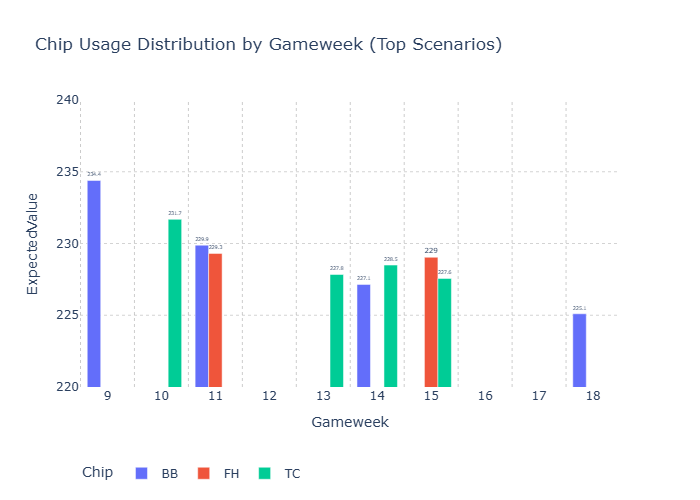

Combining Solio projections with HoF manager data into an "enhanced projection" dataset, I fed it into an optimization tool to try to find the best chip strategy. I have already used the wildcard so need to use the remaining 3 chips by GW19.

The top10 combinations follow below and included a chart with expected value per individual chip.
BB in GW9 seems like the obvious choise. For TC, a bit split between Saka in GW10 or transferring my way into Haaland later on. My issue with Saka is that Arsenal has many potential scorers but he has the potential upside from the very strong Arsenal defense (DC + CS). Haaland seems like the more obvious choice to me, even if the optimizer doesn't think so.

| Chip Combination | Score   |
| ---------------- | ------- |
| BB9, TC10, FH11  | 237.848 |
| BB9, TC10, FH15  | 236.585 |
| BB9, FH11, TC13  | 234.004 |
| BB9, FH11, TC14  | 233.782 |
| BB9, FH11, TC15  | 233.252 |
| BB9, TC13, FH15  | 232.740 |
| TC10, BB11, FH15 | 232.520 |
| BB9, TC14, FH15  | 232.519 |
| TC10, FH11, BB14 | 230.076 |
| TC10, BB14, FH15 | 228.898 |

