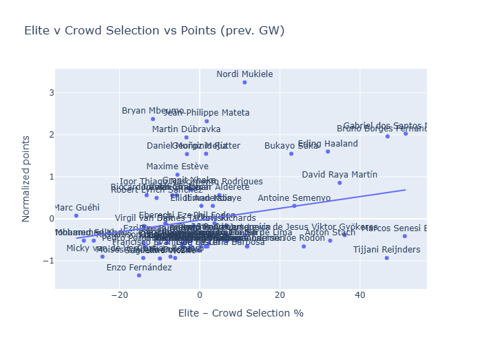

### TLDR
- Haaland continues to perform at a high level and justify the overweight from HoF managers
- City FDR lowers a bit over next 6 fixtures but still decent
- Arsenal is in great shape and with a easy run ahead, is likely to see Raya, Saka & Gabriel continuing to get love from HoF managers
- Sunderland, Villa, Brentford & Spurs with a subtantially harder set of fixtures ahead
- Liverpool, Chelseam, United & Fulham should have easier games ahead
- Matheus Cunha point projection for next 6 games is 4.4, as he comes back from holidays. Wondering if he gets some love from HoF managers
- Reijnders disappointed again. Mbeumo, which HoF managers are ignoring, had a good gameweek

### Elite players and performance

### FDR

### Measuring transfer pressure

##### Pressure to transfer in

| name                             |   crowd_own |   elite_owner_rate |   Xpts delta vs past - zscore |   Delta in FDR vs past - zscore |   Weighted zscore |   Probability of buying |
|:---------------------------------|------------:|-------------------:|------------------------------:|--------------------------------:|------------------:|------------------------:|
| Rayan Aït-Nouri                  |        0.05 |               0    |                          2.58 |                            1.47 |              2.25 |                    0.94 |
| Lucas Estella Perri              |        0    |               0    |                          3.07 |                           -0.05 |              2.14 |                    0.94 |
| Murillo Costa dos Santos         |        0.02 |               0    |                          2.42 |                            0.54 |              1.86 |                    0.91 |
| Matheus Santos Carneiro da Cunha |        0.04 |               0    |                          2.68 |                           -0.19 |              1.82 |                    0.91 |
| Reinildo Mandava                 |        0.05 |               0    |                          1.97 |                            1.33 |              1.78 |                    0.9  |
| Tosin Adarabioyo                 |        0.01 |               0.02 |                          2.58 |                           -1.04 |              1.5  |                    0.87 |
| Kiernan Dewsbury-Hall            |        0.04 |               0    |                          2.24 |                           -0.31 |              1.48 |                    0.86 |
| Youri Tielemans                  |        0.01 |               0    |                          1.4  |                            1.53 |              1.44 |                    0.86 |
| Omar Marmoush                    |        0.03 |               0    |                          1.4  |                            1.39 |              1.39 |                    0.85 |
| Matt Doherty                     |        0    |               0    |                          1.83 |                            0.34 |              1.38 |                    0.85 |
| Oleksandr Zinchenko              |        0    |               0    |                          1.62 |                            0.54 |              1.3  |                    0.84 |
| Rayan Cherki                     |        0.02 |               0    |                          1.24 |                            1.39 |              1.28 |                    0.83 |
| Bruno Borges Fernandes           |        0.17 |               0.64 |                          1.89 |                           -0.19 |              1.26 |                    0.83 |
| Bukayo Saka                      |        0.13 |               0.36 |                          1.93 |                           -0.35 |              1.25 |                    0.83 |
| Abdukodir Khusanov               |        0    |               0    |                          1.15 |                            1.47 |              1.24 |                    0.83 |

##### Pressure to transfer out

| name                         |   crowd_own |   elite_owner_rate |   Xpts delta vs past - zscore |   Delta in FDR vs past - zscore |   Weighted zscore |   Probability of selling |
|:-----------------------------|------------:|-------------------:|------------------------------:|--------------------------------:|------------------:|-------------------------:|
| Erling Haaland               |        0.66 |               0.98 |                         -5.4  |                            1.66 |             -3.28 |                     0.98 |
| Antoine Semenyo              |        0.64 |               0.88 |                         -4.47 |                           -0.38 |             -3.24 |                     0.98 |
| Ryan Gravenberch             |        0.07 |               0    |                         -3.53 |                           -1.19 |             -2.83 |                     0.97 |
| Gabriel dos Santos Magalhães |        0.33 |               0.84 |                         -3.53 |                           -0.36 |             -2.58 |                     0.96 |
| Nico O'Reilly                |        0.01 |               0    |                         -4.12 |                            1.47 |             -2.44 |                     0.95 |
| Jérémy Doku                  |        0.08 |               0.02 |                         -3.69 |                            1.39 |             -2.17 |                     0.94 |
| Omar Alderete                |        0.07 |               0.12 |                         -3.62 |                            1.33 |             -2.13 |                     0.94 |
| Matheus Nunes                |        0.01 |               0    |                         -3.49 |                            1.47 |             -2.01 |                     0.92 |
| Robin Roefs                  |        0.05 |               0    |                         -3.3  |                            1.3  |             -1.92 |                     0.92 |
| Federico Chiesa              |        0    |               0    |                         -2.1  |                           -1.19 |             -1.83 |                     0.91 |
| Emiliano Buendía Stati       |        0    |               0    |                         -3.15 |                            1.53 |             -1.74 |                     0.9  |
| Sean Longstaff               |        0.01 |               0    |                         -2.31 |                           -0.01 |             -1.62 |                     0.88 |
| Nordi Mukiele                |        0.03 |               0.14 |                         -2.84 |                            1.33 |             -1.59 |                     0.88 |
| Moisés Caicedo Corozo        |        0.16 |               0.02 |                         -1.8  |                           -0.99 |             -1.56 |                     0.88 |
| Declan Rice                  |        0.1  |               0    |                         -2.05 |                           -0.35 |             -1.54 |                     0.87 |