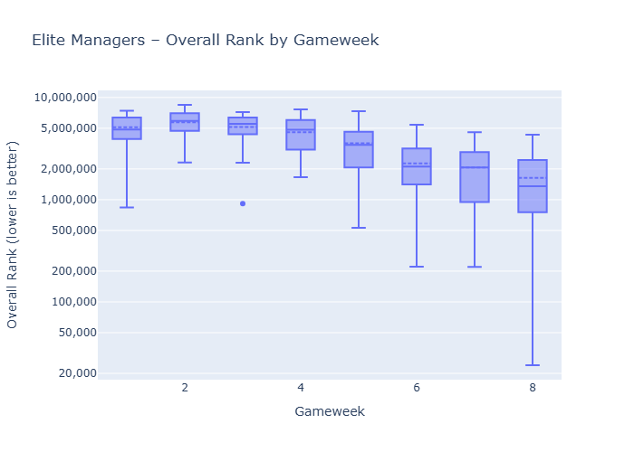
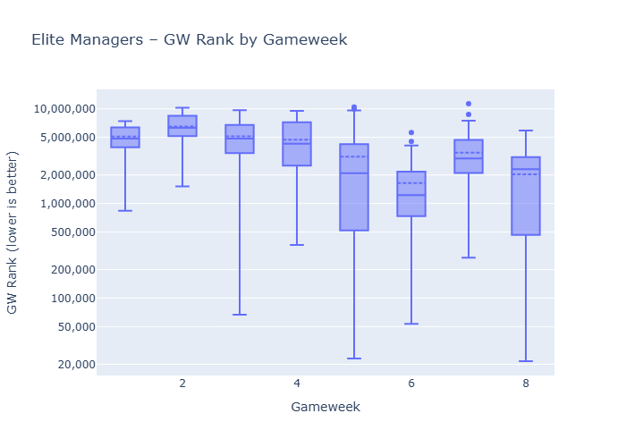
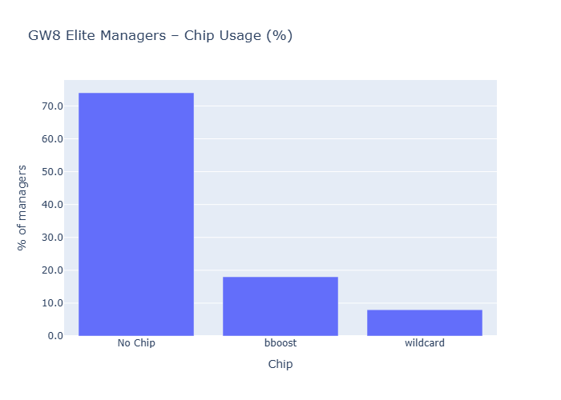

HoF did ok with the average ranking improving 400k places - [Anoop K](https://fantasy.premierleague.com/entry/199318/event/8) is off to a great start, currently sitting at 20k.
Haaland is still dominating teams, followed by Semenyo. Gabriel was subbed in by 6 managers.
Gyokeres was subbed out by 6 managers, wondering if any changes after the 2 goals scored during the week. Saka got some love, with 8 managers subbing him in. Rodon was subbed by 12 managers for the game vs Burnley, which panned out quite badly as Leeds lost 2-0.
# Top 3 Starters by Gameweek

|   gw | Top1                        | Top2                               | Top3                                     |
|-----:|:----------------------------|:-----------------------------------|:-----------------------------------------|
|    1 | Cole Palmer (50, 100.0%)    | Mohamed Salah (49, 98.0%)          | Pedro Porro Sauceda (45, 90.0%)          |
|    2 | Mohamed Salah (49, 98.0%)   | Maxime Estève (41, 82.0%)          | Florian Wirtz (34, 68.0%)                |
|    3 | Mohamed Salah (48, 96.0%)   | Pedro Porro Sauceda (44, 88.0%)    | Bruno Borges Fernandes (34, 68.0%)       |
|    4 | Mohamed Salah (49, 98.0%)   | Pedro Porro Sauceda (37, 74.0%)    | Bruno Borges Fernandes (33, 66.0%)       |
|    5 | Mohamed Salah (48, 96.0%)   | Bruno Borges Fernandes (33, 66.0%) | Joachim Andersen (33, 66.0%)             |
|    6 | Erling Haaland (50, 100.0%) | Tijjani Reijnders (43, 86.0%)      | Antoine Semenyo (42, 84.0%)              |
|    7 | Erling Haaland (48, 96.0%)  | Marcos Senesi Barón (43, 86.0%)    | Antoine Semenyo (42, 84.0%)              |
|    8 | Erling Haaland (49, 98.0%)  | Antoine Semenyo (44, 88.0%)        | Gabriel dos Santos Magalhães (42, 84.0%) | 

# Top 3 Captains by Gameweek

|   gw | Top1                               | Top2                      | Top3                             |
|-----:|:-----------------------------------|:--------------------------|:---------------------------------|
|    1 | Mohamed Salah (49, 98.0%)          | Erling Haaland (1, 2.0%)  | None                             |
|    2 | Mohamed Salah (46, 92.0%)          | Bukayo Saka (3, 6.0%)     | Erling Haaland (1, 2.0%)         |
|    3 | Bruno Borges Fernandes (27, 54.0%) | Mohamed Salah (11, 22.0%) | Chris Wood (5, 10.0%)            |
|    4 | Mohamed Salah (49, 98.0%)          | Erling Haaland (1, 2.0%)  | None                             |
|    5 | Mohamed Salah (47, 94.0%)          | Antoine Semenyo (1, 2.0%) | Bruno Borges Fernandes (1, 2.0%) |
|    6 | Erling Haaland (50, 100.0%)        | None                      | None                             |
|    7 | Erling Haaland (47, 94.0%)         | Bukayo Saka (2, 4.0%)     | Viktor Gyökeres (1, 2.0%)        |
|    8 | Erling Haaland (49, 98.0%)         | Mohamed Salah (1, 2.0%)   | None                             | 

### Subbed IN (biggest increases)

| player                         |   latest |   prev |   delta |
|:-------------------------------|---------:|-------:|--------:|
| Joe Rodon                      |       16 |      4 |      12 |
| Anton Stach                    |       18 |     10 |       8 |
| Bukayo Saka                    |       18 |     10 |       8 |
| Martin Dúbravka                |       16 |      9 |       7 |
| Gabriel dos Santos Magalhães   |       42 |     36 |       6 |
| Ismaïla Sarr                   |        9 |      3 |       6 |
| João Pedro Junqueira de Jesus  |       37 |     31 |       6 |
| Nordi Mukiele                  |        7 |      1 |       6 |
| Omar Alderete                  |        6 |      1 |       5 |
| Lucas Tolentino Coelho de Lima |        5 |      0 |       5 | 

### Subbed OUT (biggest decreases)

| player                              | latest | prev | delta |
| :---------------------------------- | -----: | ---: | ----: |
| Iliman Ndiaye                       |      7 |   25 |   -18 |
| James Tarkowski                     |      3 |   19 |   -16 |
| Joško Gvardiol                      |      2 |    9 |    -7 |
| Viktor Gyökeres                     |     31 |   37 |    -6 |
| Bruno Borges Fernandes              |     32 |   38 |    -6 |
| Richarlison de Andrade              |      0 |    5 |    -5 |
| Đorđe Petrović                      |      1 |    5 |    -4 |
| Francisco Evanilson de Lima Barbosa |      0 |    4 |    -4 |
| Ollie Watkins                       |      0 |    4 |    -4 |
| Marcos Senesi Barón                 |     39 |   43 |    -4 |

### More captained

| player         |   latest |   prev |   delta |
|:---------------|---------:|-------:|--------:|
| Erling Haaland |       49 |     47 |       2 |
| Mohamed Salah  |        1 |      0 |       1 | 

### Less captained

| player          |   latest |   prev |   delta |
|:----------------|---------:|-------:|--------:|
| Bukayo Saka     |        0 |      2 |      -2 |
| Viktor Gyökeres |        0 |      1 |      -1 |

